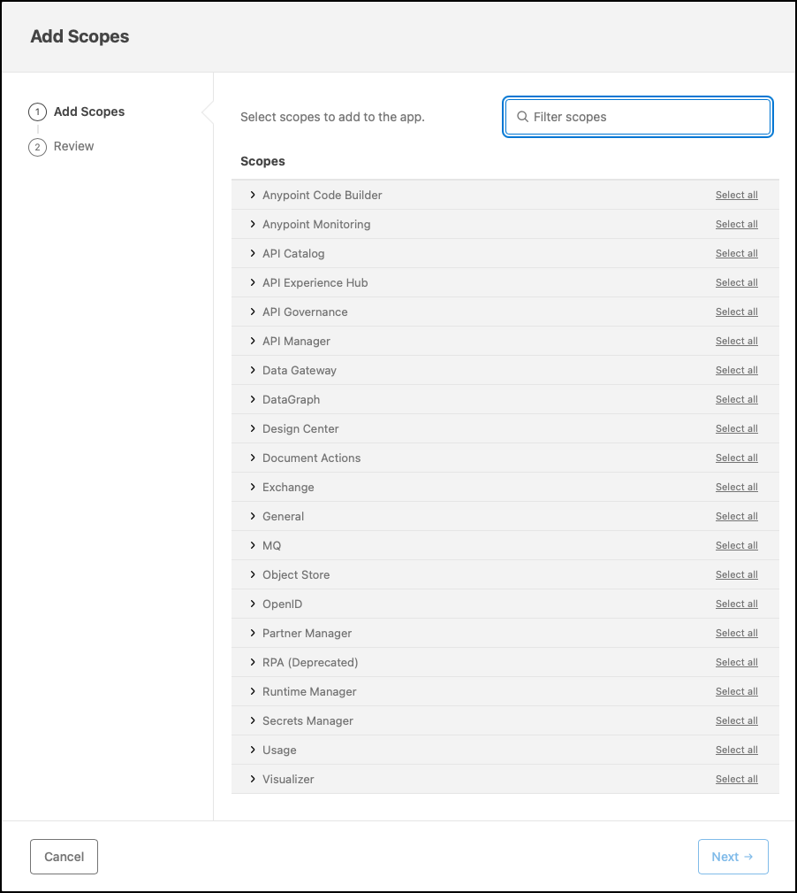

# Anypoint CLI Authentication for CI/CD Pipelines

## Abstract

This informal document discusses three authentication approaches when using the Anypoint Platform Command-Line Interface (Anypoint CLI).

## Purpose

The purpose of this document is to complement MuleSoft’s official documentation, not to replace it. It describes and compares the available authentication methods for the Anypoint CLI. It explains practical considerations for each method and provides guidance on selecting an approach suitable for CI/CD pipelines, with a focus on using connected apps.

## Overview

The article [Authentication to the Anypoint Platform CLI](https://docs.mulesoft.com/anypoint-cli/latest/) outlines three authentication approaches: using a bearer token, a client ID and client secret, or a username and password. However, it overlooks the critical importance of applying the principle of least privilege and lacks practical specificity. Each authentication method can vary in real-world applications. For example, depending on your Anypoint Platform configuration, you might use a personal or dedicated account (i.e., username and password), a connected app, or a SAML assertion to generate a bearer token. 

The purpose of this repository is to lay the groundwork for CI/CD pipelines that automate API management for Anypoint Flex Gateway. Although bearer tokens provide short-lived, scoped access, they introduce additional steps without meaningfully improving overall security, since initial authentication and secure credential management remain the main risk factors. Whether using accounts, connected apps, or SAML assertions to generate tokens, the fundamental security posture depends on how these credentials are handled in the pipeline. 

While authenticating to the Anypoint CLI with a username and password is possible, it is generally not recommended for CI/CD pipelines. Personal accounts often introduce unnecessary permissions and make password rotation more difficult. A dedicated account with limited permissions helps mitigate risks but still involves securely storing long-lived credentials and managing their rotation. Username and password authentication is best reserved for ad-hoc testing or temporary manual use. 

A connected app with a client ID and client secret is best suited for CI/CD pipelines. It removes dependency on user credentials, enforces least privilege, and simplifies long-term maintenance. A dedicated connected app for automation allows scoped access, limited permissions, and straightforward credential rotation. For production pipelines, store the client secret in a secure vault such as Azure Key Vault, AWS Secrets Manager, or GitHub Actions Secrets. Although the client secret is long-lived and requires secure storage, this method is safer, more maintainable, and auditable, without the need for frequent token refreshes.

## Summary of Authentication Methods

| Authentication Method   | Pros                                          | Cons                                                    | Recommended Use                        |
| ----------------------- | --------------------------------------------- | ------------------------------------------------------- | -------------------------------------- |
| **Bearer Token**        | Short-lived, scoped access                    | Requires other credentials to generate; expires quickly | Rarely used in CI/CD                   |
| **Client ID & Secret**  | Best for automation; supports least privilege | Requires secure secret storage                          | :white_check_mark: Preferred for CI/CD |
| **Username & Password** | Simple for ad-hoc use                         | Long-lived, hard to rotate, risky for automation        | Manual testing only                    |

## Using a Connected App with the Anypoint CLI

Several articles within the MuleSoft documentation, as well as resources available on the internet, outline how to create a connected app that acts on its own behalf. This section, nonetheless, provides a step-by-step approach for configuring a connected app and using its client ID and secret for authentication when executing Anypoint CLI commands.

- First, in a browser, log in to the Anypoint Platform (https://anypoint.mulesoft.com).
- On the landing page, select **Access Management** towards the bottom right of the page.
- In **Access Management**, select the **Connected Apps** option from the left menu.
- On the **Connected Apps** page, you can optionally select a **Business Group** from the drop-down list.

> [!TIP]
> The selected *Business Group* directly influences which business groups are available when adding scopes to the connected app. For example, selecting the root organization lets you choose the root organization, its descendants, or both.
>
> As a reminder, a scope is a role with associated permissions that determines the actions the connected app can perform within a business group and environment [1]. 

- Click the **Create app** button to create a new connected app.
- On the **Create app** form:
  - Enter a **Name** for your connected app,
  - Select the option **App acts on its own behalf (client credentials)** for the **Type**, and
  - Click the **Add Scopes** button.

- In the **Add Scopes** dialog:
  - For step 1, **Add Scopes**, select the scopes listed in the table below.

| Scopes   | Roles                |
| -------- | -------------------- |
| Exchange | Exchange Contributor |

  - For step 2, **Select Business Groups**, select all the relevant business groups; i.e., where you plan to register and manage APIs.
  - For step 3, **Review,** optionally review your selection and click the **Add Scopes** button.
- Click the **Save** button.
- Finally, on the **Connected Apps** page, you can copy the client ID and client secret by clicking the **Copy Id** and **Copy Secret** buttons, respectively. You will need those values for authentication when executing Anypoint CLI commands.

## Where This Fits in the Lifecycle

This document discusses authentication, which is required to automate API management with the Anypoint CLI. You must choose and configure your authentication method before running any CLI commands that interact with the Anypoint Platform, including:

- Publishing versioned APIs to Anypoint Exchange.
- Registering APIs in Anypoint API Manager.
- Deploying APIs to Anypoint Flex Gateway.
- Applying policies programmatically.
- Promoting APIs across environments.

Once authentication is in place, continue with the API management lifecycle for Flex Gateway starting at:

- [02-exchange-cataloging/publish-assets-to-anypoint-exchange](../02-exchange-cataloging/publish-assets-to-anypoint-exchange.md)

Review [01-lifecycle-overview/README.md](file:///Users/abelisle/Documents/GitHub/Mule-Docs/anypoint-flex-apim-automation/01-lifecycle-overview/README.md) for a concise explanation of the API management automation lifecycle and how these stages relate to one another.

# References

- [1] https://docs.mulesoft.com/access-management/creating-connected-apps-dev#create-connected-app-on-its-own-behalf

# Additional Resources

- Authentication to the Anypoint Platform CLI - https://docs.mulesoft.com/anypoint-cli/latest/auth
- How to generate your Authorization Bearer token for Anypoint Platform - https://help.salesforce.com/s/articleView?id=001115323&type=1
- Obtaining an API Bearer Token Using a SAML Assertion - https://docs.mulesoft.com/access-management/saml-bearer-token
- Getting the Bearer Token for a Connected App Example - https://docs.mulesoft.com/access-management/connected-app-bearer-token-example
- How to Get the Anypoint Authorization Access or Bearer Token from Chrome Browser Session - https://help.salesforce.com/s/articleView?id=001116775&type=1
- How long does an Anypoint bearer token expire? - https://help.salesforce.com/s/articleView?id=001118158&type=1
- How to use Anypoint CLI with a connected app - https://help.salesforce.com/s/articleView?id=001117606&type=1
- Creating Connected Apps - https://docs.mulesoft.com/access-management/creating-connected-apps-dev
