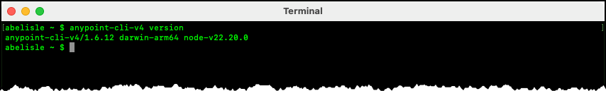

# Anypoint CLI Installation for CI/CD Pipelines

## Abstract

This informal document discusses installing the Anypoint Platform Command-Line Interface (CLI), or simply the Anypoint CLI.

## Purpose

This document complements MuleSoft's documentation, not replacing it. It provides additional documentation and examples to help you get started quickly.

## Overview

Before installing the Anypoint CLI, ensure your environment meets the following system prerequisites:

| Requirement | Recommended / Tested Version | Notes |
|--------------|---------------------|-------|
| **Node.js** | 18.x – 22.x (LTS) - see note below. | Officially supported: 18–20. Tested successfully with 22.20.0. |
| **npm** | 9.x or later | Tested with version 11.6.2. |
| **Operating System** | macOS, Linux, or Windows | Choose the appropriate installation method for your OS. |

As discussed in the article [Installing Anypoint CLI 4.x](https://docs.mulesoft.com/anypoint-cli/latest/install), you must first install `Node.js` and `npm` before installing the Anypoint CLI. As implied in this article, the suggested approach is to follow the instructions provided on the [Download Node.js](https://nodejs.org/en/download/) web page. This web page lets you to chose the `Node.js` version, target operating system, installation method, and package manager, and it tailors the installation instructions accordingly. Optionally, you can download a prebuilt installation package specific to your target operating system. 


> [!NOTE]
>
> While the [official documentation](https://docs.mulesoft.com/anypoint-cli/latest/install) specifies `Node.js` versions 18.0.0 to 20.0.0, all examples in this repository have been authored and successfully tested with `Node.js` 22.20.0 LTS and `npm` 11.6.2. This indicates that newer LTS versions of Node.js may also work in practice, even if they are not explicitly listed as supported.
>
> Upgrade `npm`  to the latest stable version using the instructions provided in the article [Try the latest stable version of npm](https://docs.npmjs.com/try-the-latest-stable-version-of-npm).

Install the Anypoint CLI core package using the following command:

```text
npm install -g anypoint-cli-v4
```

As a smoke test, run the following command to verify that the installation completed successfully and to display the CLI version:

```text
anypoint-cli-v4 version
```



By default, no plugins are installed with the Anypoint CLI core package. To follow the principle of least privilege, install only the **API Manager** and **Exchange** plugins with the command below:

```text
anypoint-cli-v4 plugins:install anypoint-cli-api-mgr-plugin anypoint-cli-exchange-plugin
```

To verify that the plugins installed successfully, run:
```text
anypoint-cli-v4 plugins
```


## Where This Fits in the Lifecycle

This document covers **installation prerequisites** for working with the Anypoint Platform Command Line Interface (CLI). Installing the Anypoint CLI is a foundational step that must be completed before any lifecycle stage that relies on CLI-based automation, including:

- Authenticating to the Anypoint Platform.
- Publishing assets to Anypoint Exchange.
- Registering APIs in Anypoint API Manager.
- Deploying APIs to Anypoint Flex Gateway.
- Applying policies and promoting APIs across environments.

Once the CLI is installed, the next step is to configure authentication for automated, non-interactive usage:

- [00-prerequisites/anypoint-cli-authentication.md](./anypoint-cli-authentication.md)

For a high-level view of the full automation lifecycle and how these stages relate to one another, see:

- [01-lifecycle-overview/README.md](../01-lifecycle-overview/README.md)
