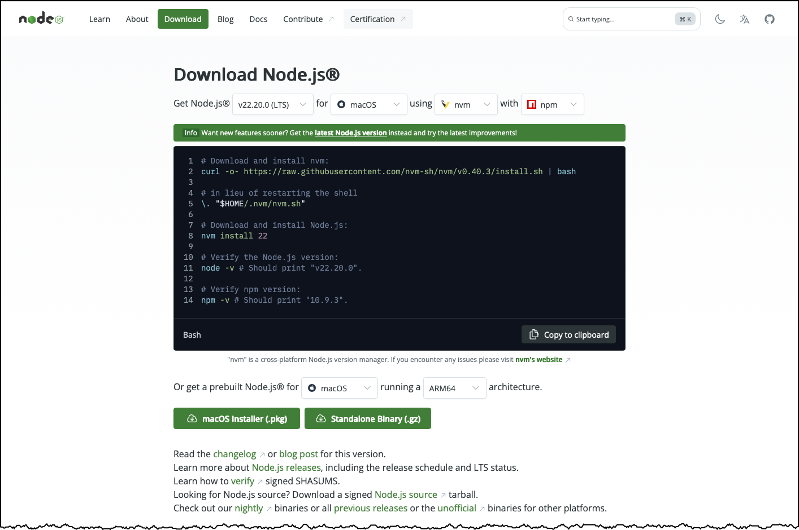
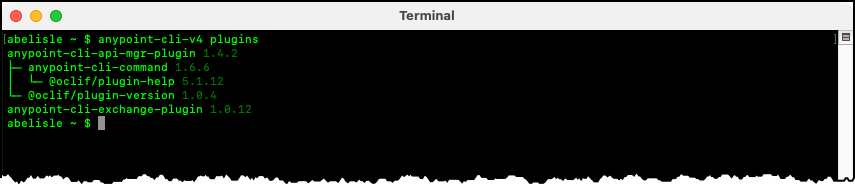

# Anypoint CLI Installation for CI/CD Pipelines

## Abstract

This informal document discusses the installation of the Anypoint Platform Command-Line Interface (CLI) — or simply the Anypoint CLI. 

## Purpose

The purpose of this document is to complement the documentation that MuleSoft publishes, not to replace it. It aims to provide additional documentation and examples to help you get started quickly.

# Installing the Anypoint CLI

## Overview

Before installing the Anypoint CLI, ensure your environment meets the following system prerequisites:

| Requirement | Recommended Version | Notes |
|--------------|---------------------|-------|
| **Node.js** | 18.x – 22.x (LTS) | Officially supported: 18–20. Tested successfully with 22.20.0. |
| **npm** | 9.x or later | Tested with version 11.6.2. |
| **Operating System** | macOS, Linux, or Windows | Choose the appropriate installation method for your OS. |

As discussed in the article [Installing Anypoint CLI 4.x](https://docs.mulesoft.com/anypoint-cli/latest/install), you must first install `Node.js` and `npm` before installing the Anypoint CLI. As implied in this article, the suggested approach is to follow the instructions provided on the [Download Node.js](https://nodejs.org/en/download/) web page. This web page enables you to pick the `Node.js` version, target operating system, installation method, and package manager, and it tailors the installation instructions accordingly. Optionally, you can download a prebuilt installation package specific to your target operating system. 



> [!NOTE]
>
> While the [official documentation](https://docs.mulesoft.com/anypoint-cli/latest/install) specifies `Node.js` versions 18.0.0 to 20.0.0, all examples in this repository have been authored and successfully tested using `Node.js` version 22.20.0 LTS and `npm` version 11.6.2.
>
> It is recommended to upgrade `npm`  to the latest stable version using the instructions provided in the article [Try the latest stable version of npm](https://docs.npmjs.com/try-the-latest-stable-version-of-npm).

Install the Anypoint CLI core package using the following command:

```text
npm install -g anypoint-cli-v4
```

As a smoke test, run the following command to verify that the installation completed successfully and to display the CLI version:

```text
anypoint-cli-v4 version
```


By default, no plugins are installed with the Anypoint CLI core package. To follow the principle of least privilege, install only the **API Manager** and **Exchange** plugins using the command below:

```text
anypoint-cli-v4 plugins:install anypoint-cli-api-mgr-plugin anypoint-cli-exchange-plugin
```

To verify that the plugins installed successfully, run:
```text
anypoint-cli-v4 plugins
```



## Next Steps

The Anypoint CLI and required plugins are installed. Next, you need to configure authentication for executing Anypoint CLI commands. For details, see the [Anypoint CLI Authentication for CI/CD Pipelines](anypoint-cli-authentication.md) document.
